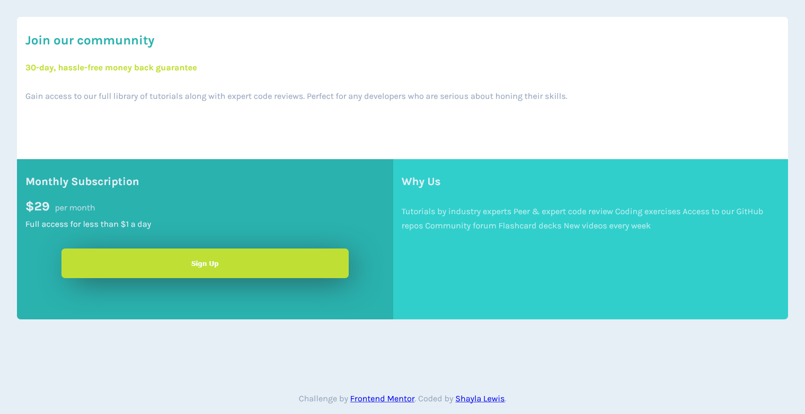

# Frontend Mentor - Single price grid component solution

This is a solution to the [Single price grid component challenge on Frontend Mentor](https://www.frontendmentor.io/challenges/single-price-grid-component-5ce41129d0ff452fec5abbbc). Frontend Mentor challenges help you improve your coding skills by building realistic projects. 

## Table of contents

- [Overview](#overview)
  - [The challenge](#the-challenge)
  - [Screenshot](#screenshot)
  - [Links](#links)
- [My process](#my-process)
  - [Built with](#built-with)
  - [What I learned](#what-i-learned)
  - [Continued development](#continued-development)
  - [Useful resources](#useful-resources)
- [Author](#author)
- [Acknowledgments](#acknowledgments)

**Note: Delete this note and update the table of contents based on what sections you keep.**

## Overview

### The challenge

Users should be able to:

- View the optimal layout for the component depending on their device's screen size
- See a hover state on desktop for the Sign Up call-to-action

### Screenshot

 

### Links

- Solution: [GitHub](https://github.com/shaylalewis/single-price)
- Live Site: [Netlify](https://61c9e459fd45e080d9f68302--shaylalewis.netlify.app/)

## My process

### Built with

- Semantic HTML5 markup
- Flexbox
- CSS Grid
- Mobile-first workflow

### Continued development

I would love to continue working on CSS. As I build more projects mobile first I notice that I'm getting more comfortable with it. Before I was afraid of media queries but now i use them often. I also want to work more with grid. I've worked quite a bit with flexbox and feel comfortable with that but this was my first project using CSS grid. I would also like to try using styled componets and a CSS preprocessor. 

### Useful resources

- [W3Schools](https://www.w3schools.com/CSSref/pr_grid.asp) 
- [MDN](https://developer.mozilla.org/en-US/docs/Web/CSS/CSS_Grid_Layout/Basic_Concepts_of_Grid_Layout) 
- Both of the above resources have helped me with grid. i usually find success using two resources fora single topic. Both of these sites are great resources I recommend for beginners.

## Author

- Frontend Mentor - [@shaylalewis](https://www.frontendmentor.io/profile/shaylalewis)
- Twitter - [ @css_strudel](https://www.twitter.com/css_strudel)
